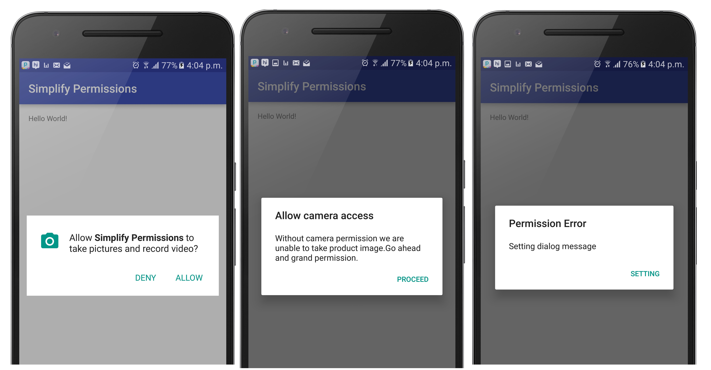

# Simplify Permission

Simplify Android permission with in-build message Dialogs.



### Feature
- InBuild Rational Dialog with custom message
- InBuild SettingScreen Dialog with custom Message.
- Callback for permission state :
    - Permission granted
    - Permission removed
    - Permission access removed.

### How to use

 - Extent **Activity** to **MarshmallowSupportActivity**
```
    public class MainActivity extends MarshmallowSupportActivity
```

- Create **PermissionBuilder**.

```
            String[] CAMERA_PERMISSIONS = {Manifest.permission.CAMERA};

            PermissionBuilder permissionBuilder =
            new PermissionBuilder(CAMERA_PERMISSIONS,REQUEST_CARMERA, mPermissionCallback);
            .enableDefaultRationalDialog("Ration dialog title", "Ration Dialog message")
            .enableDefaultSettingDialog("Setting Dialog title", "Setting dialog message");

```

- Call **requestAppPermissions(permissionBuilder.build())**

```
            requestAppPermissions(permissionBuilder.build());
```
- Handle Permission callBacks

```
    private mPermissionCallback = new PermissionCallback(){

        @Override
        public void onPermissionGranted(int requestCode) {

        }

        @Override
        public void onPermissionDenied(int requestCode) {

        }

        @Override
        public void onPermissionAccessRemoved(int requestCode) {

        }
    }

```

[](https://jitpack.io/#anshulagarwal06/Simplify-Permissions)

# Download

Include `jitpack.io` inside of **root** project `build.gradle`:

```groovy
allprojects {
		repositories {
			...
			maven { url "https://jitpack.io" }
		}
	}
```

After that you can easily include the library in your **app** `build.gradle`:

```groovy
dependencies {
	        compile 'com.github.anshulagarwal06:Simplify-Permissions:v1'
	}
```

That's it. build your project.

